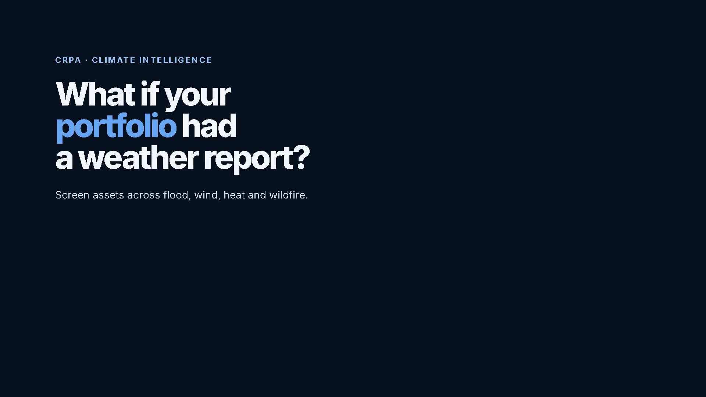
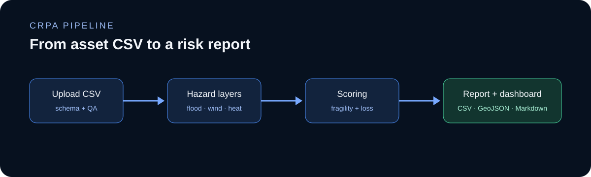
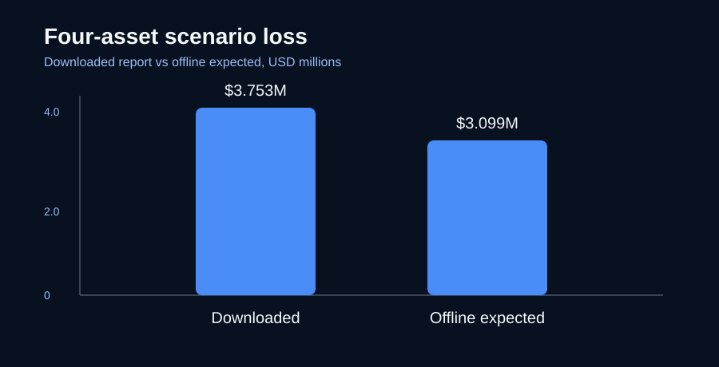
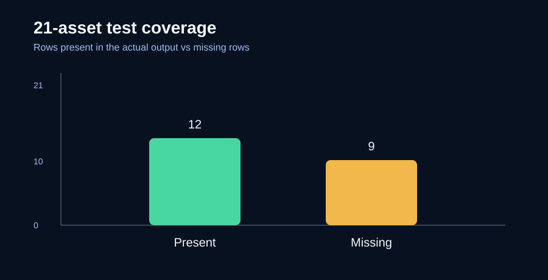

# Climate Risk Portfolio Assessor

Climate Risk Portfolio Assessor (CRPA) reads an asset CSV and produces multi-hazard screening scores, scenario loss estimates, a Streamlit dashboard, and a Markdown report. It runs locally and is distributed under a proprietary commercial license.

When no live layers or API keys are available, CRPA uses synthetic demo values. Each result records its source and confidence so demo values remain separate from values backed by a real dataset.

## Product preview





The short product preview is also available as [`brag.mp4`](../brag-output-2026-10-07-120000/brag.mp4) in the development workspace.

## Start the app

On Linux or macOS:

```bash
./run.sh setup
./run.sh dashboard   # http://localhost:8502
./run.sh api         # http://localhost:8000/docs
```

On Windows:

```powershell
python -m venv .venv
.venv\Scripts\pip install -r requirements-dev.txt
.venv\Scripts\streamlit run app\dashboard.py
```

The `run.bat` file starts the API and dashboard together. To run the command-line workflow:

```bash
./run.sh cli data/templates/portfolio_upload_template.csv --scenario ssp585 --no-llm
```

## Input CSV

The required columns are:

```text
asset_id,name,lat,lon,state,asset_class,replacement_value
```

Supported asset classes include office, industrial, retail, residential, hospital, data_center, infrastructure, hotel, and other. Values such as `50000000`, `$50,000,000`, `50M`, and `2.5k` are accepted. The default limit is 500 assets and can be changed with `CRPA_MAX_ASSETS`.

CRPA checks the schema, coordinates, duplicate IDs, duplicate assets, null-island coordinates, state and coordinate mismatches, and coordinate precision. Invalid rows are dropped and described in the QA report.

## How a run works

1. `src/ingestion.py` validates the input and performs spatial checks.
2. `src/hazards.py` reads local rasters, cached or free APIs, and then synthetic fallbacks. Each result carries a source label.
3. `src/fragility.py` applies the current HAZUS-inspired screening curves and calculates hazard scores and scenario loss.
4. `src/reporting.py` calls the configured OpenAI-compatible LLM when available. If the call fails, CRPA writes a deterministic report instead.

Results are written below `outputs/<run-id>/`, including asset scores, GeoJSON, an optional GeoPackage, a portfolio summary, QA details, and the report.

## Data sources

| Hazard | Current source path |
| --- | --- |
| Flood | Pakistan uses the JRC Global FloodMap 20-year depth raster. FEMA NFHL is supported for US state GeoPackages only. |
| Elevation | Local Copernicus GLO-90 tiles, OpenTopography COP30, then Open-Meteo point elevation. |
| Wind | Open-Meteo ERA5 gusts or a local WGS84 raster in metres per second. |
| Heat | Open-Meteo ERA5 temperature, NOAA CDO stations, or a local Celsius raster. |
| Wildfire | NASA FIRMS active-fire observations or a local burn-probability raster. |

Install geospatial dependencies and download the Pakistan layers with:

```bash
pip install -r requirements-geo.txt
python scripts/download_pakistan_hazards.py
```

The download script writes ignored local rasters. Keep the source, license, AOI, CRS, resolution, and retrieval date with any data you distribute. FEMA NFHL is a US program and does not provide a national Pakistan layer.

API credentials belong in `.env`, which is ignored by Git. Use `.env.example` as the template. Never commit the real file or paste its values into an issue, log, notebook, or release archive.

## AI reports

Set `NVIDIA_API_KEY` for the NVIDIA OpenAI-compatible endpoint, or configure another compatible endpoint through the variables in `.env.example`. `LLM_TIMEOUT` defaults to 120 seconds. AI failures use the deterministic report path, so the assessment still completes.

## Limits

These are screening results. The curves are HAZUS-inspired defaults, not licensed HAZUS parameters. Expected loss is scenario-based and does not model deductibles, building age, floor height, construction type, or annual return periods. ERA5 is a coarse reanalysis product, FIRMS measures recent fire activity, and future scenarios use parameter uplifts rather than downscaled climate projections. Review outputs with a qualified risk professional before using them for a regulated decision.

## Repository layout

```text
app/                 Streamlit dashboard
api/                 FastAPI service
src/                 ingestion, hazards, scoring, reporting
data/                samples, templates, and local-data notes
scripts/             data download helpers
tests/               API and dashboard checks
Github/              clean export prepared for publication
```

## Comparison charts

### Four-asset loss comparison



### 21-asset output coverage



The detailed comparison brief remains in the local assessment outputs because it contains portfolio-level test details.

## License

This repository is proprietary and all rights are reserved. Use, resale, redistribution, and derivative products require a written commercial license. Third-party datasets keep their own licenses and attribution requirements. See [`LICENSE`](LICENSE).
